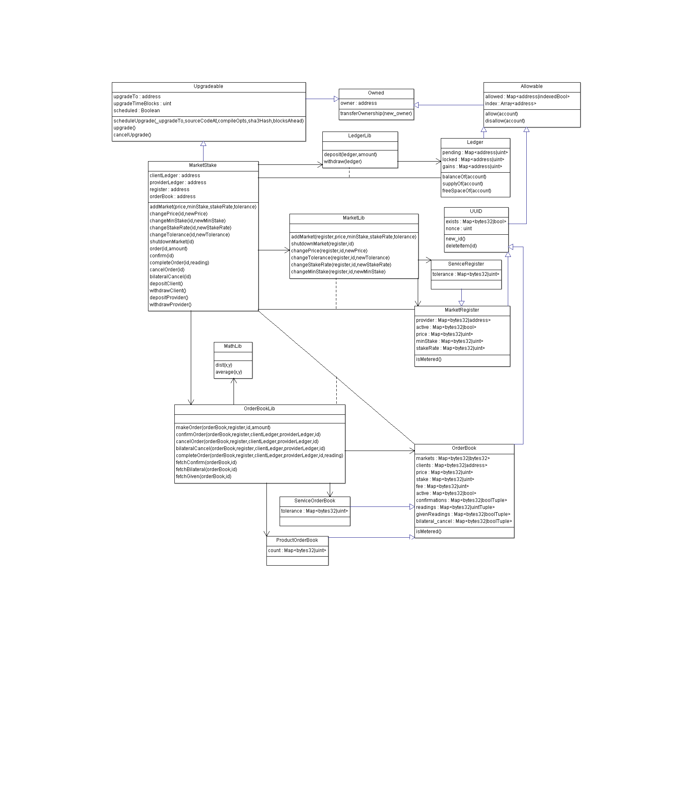

# MarketStake
Proof of concept for an Ethereum contract for buying and selling products and services off-chain using stakes to incentivize cooperaton and reduce risk of fraud.

## Disclaimer
Use MarketStake at your own risk.

Read and understand source code before use.

More details found in [LICENSE](./LICENSE).

## Documentation

### Description

The smart contract acts essentially as an automated escrow and marketplace. It keeps a database of markets for metered or non-metered goods or services, depending on which contract is used. Metered goods are any goods whose final cost is dependent on a measurement e.g. electricity consumption. Non-metered goods have a fixed costs, though one can still order multiple items of the same goods in the same order.

The smart contract incentivize cooperation by making the client and provider lock away stakes of ether onto the contract when orders are activated. These stakes can only be returned by completing the transaction, with the price having been transferred from the stakes if necessary.

To complete the transaction, one can either fill the order or cancel it (unilaterally or bilaterally). Filling the order requires the client and provider to agree on readings. These readings are e.g. a token id on the packaging or the number of delivered items for non-metered goods, or measurements for metered goods. Metered goods can have a maximum tolerance on the distance between client's and provider's readings. This is to take account the sensitivity of sensors and other errors. If the readings match, the average is chosen for the cost computations.

For dispute resolution, the contract offers two alternatives: unilateral cancellation and bilateral cancellation. Unilateral cancellation acts as breach of contract, thus if the order is active, the canceller pays a fee equal to the full price of the goods to the other party.

Bilateral cancellation requires both parties to agree to it. If successful, the stakes are returned in full.

This contract does not make use of timers for the orders as timers can be exploited by whomever the expiration benefits, of which there will always be if the value of the goods is taken into account.

The contract is upgradeable, but deliberately makes it difficult for the owner of the contract to upgrade by requiring the upgrade to be advertised in advance by at least roughly two weeks. The contract would need to be deployed at the advertised address along with the location of the source et al. This is to ensure that the users of the contract have enough time to bail out should they be concerned about the upgrade path.

Note that this does make bug patches slow to push.

### Requirements

MarketStake uses [Truffle](http://truffleframework.com/) v for migrations and deployment.

The program has been tested against [TestRPC](https://github.com/ethereumjs/testrpc) v4.0.1. To test it similarly, please install TestRPC.

### How to Run

Ensure that TestRPC is running.

Compile the contracts using `truffle compile` from the main folder.

Migrate the libraries using `truffle migrate`

Deploy the contract using either `truffle exec deployDapp.js` or `truffle exec deployServiceDapp.js`, which are the non-metered and metered version respectively. The commands print to the console the address to the main contract interface.

Use your favorite Ethereum/Web3 client to interface with the contract.

### How to Use

Providers can create markets by sending the `addMarket` market transaction. The `LogNewMarket` event notifies the users of the market ID. Certain market properties can be modified sending the `changeX` transaction, where `X` is the desired property to be changed. Note that these changes do not affect created orders. The market can be shutdown with the `shutdownMarket` transaction, though it counts as a breach of contract for any active orders.

Clients (and providers) may order goods or services with the `order` transaction. This creates a new, unconfirmed and inactive order. The `LogNewOrder` event notifies users of its id, along with unit price, amount and stake. If the client and provider find the conditions acceptable, they may confirm the order with the `confirm` transaction. If both confirm it, the order is activated, notified by the `LogOrderActivated` event. This requires that at least `stake` amount of ether has been deposited by client and provider sending `depositClient` and `depositProvider` transactions respectively.

To complete the order, use the `completeOrder` transaction. Any off-chain transfer of goods or services should be completed in a secure manner before this. Both provider and client must signal the order's completion and if the readings match, the order is filled, the cost is transferred and leftover stakes returned. `LogOrderFilled` notifies users of this. Deposited ether can then be withdrawn sending the `withdrawClient` or `withdrawProvider` transactions.

To cancel, the provider or client may unilaterally cancel by sending the `cancelOrder` transaction, or bilaterally cancel by sending the `bilateralCancelOrder` transaction.

The market register, order book and ledgers can be accessed at the addresses specified by the `register`, `orderBook`, `providerLedger` and `clientLedger` calls respectively.

Read the [ABI](#abi) section for more details.

### UML



Not listed are trivial getters and setters, events, and internal and private functions.

### Known issues

#### Non-technical

##### Relative value problem

The idea behind MarketStake is to force two contractual parties to cooperate through economic incentive. Two economically rational parties, even if they don't trust each other, will still behave productively as they stand to gain their stakes back (after transaction fees and product/service price). In order for this to occur, the stake (which includes the price) must be greater than the price by some factor _k_ > 1. How large that factor needs to be is anyone's guess, but MarketStake accepts any integer _n_ > 1 and realistically needs to take transaction fees into account. Thus by not cooperating, the non-cooperator risks losing his whole stake, which is at least twice the price.

What is not factored in, however, and is difficult to mitigate is that the penalty of non-cooperating can still be relatively small compared to the non-cooperator's funds and/or income. Such a non-cooperator could simply eat the losses. Raising the stakes means fewer can afford to do so, but fewer honest parties can also afford to lay stakes.

An alternative approach is to implement a timer. However, if the stakes are returned at the end of the timer, then the client could simply receive the product and wait out the timer and get his money back. Alternatively, the provider can signal the contract the product has been delivered, thus the timer running out would transfer the price to the provider. However, this is also abusable as now the provider has no incentive to deliver what was promised, product or no. Both parties must agree that the product has arrived.

Which brings us to another problem...

##### Dead non-cooperator

If one of the parties were to "disappear", then the funds would stay locked in the contract forever. As a timer would again be abusable, it is uncertain what could be done about this. I don't expect large providers and clients to drop off the planet without someone coming to pick up the assets. The hope is that larger parties will have a reduced risk of dead non-cooperator and smaller parties won't induce too large costs.

Until accounts are tied to national IDs alongside a trusted, external party that can verify the "state" of the account, there is little else that can be done.

##### Dispute resolution

MarketStake is not a dispute resolver, it is merely the infrastructure for trustless off-chain transactions where the two parties don't even need to meet. The delivery address could be in the public, or a dead drop. If a dispute arises, all that MarketStake offers is unilateral and bilateral cancellation, the former having the cancelling party pay a cancellation fee and the latter returning the stakes in full.

At the moment, any other form of dispute resolution is up to the client and provider.

##### Poisoned Apple Attack

As with any unregulated market, there is a serious concern for poisoned goods i.e. goods where the act of getting a reading (e.g. sampling an apple before entering the token ID) is potentially dangerous to the party getting the reading. As governmental action cannot be counted on, there still exists a level of _caveat emptor_ to be considered.

On its own, a poisoned apple attack is relatively expensive. However, if the provider's being paid by a third party to sell poisoned apples, the provider may not even care about getting the funds back from the contract.

Thus the need for reputation still exists. But hopefully in a less significant manner.

##### Third-Party Collusion Attack

A third-party collusion attack is where the client colludes with a third party unknown to the provider. This third party would try to steal the product while in transit and the client would try to convince the provider that the product never arrived. The provider would then either send a new product or bilaterally cancel. The third party would afterwards hand over the stolen good to the client, leaving the client with the product without having to pay for it.

An on-chain solution is unknown to me. The best way to mitigate is to ensure the transport is secure and preferrably on a secret delivery path/schedule.

### Technical

#### TestRPC double spend

There appears to be a bug in TestRPC v4.0.1 where calling a payable function that calls library functions causes the TestRPC VM to charge more than once the transaction value. It is unknown if this occurs on Ropsten or the main network.

## ABI

### MarketStake is Upgradeable

#### Data
```
address public clientLedger;
address public providerLedger;
address public register;
address public orderBook;
```

#### Events
```
event LogNewMarket(bytes32 id);
event LogMarketShutdown(bytes32 id);
event LogMarketPriceChanged(bytes32 id, uint oldPrice, uint newPrice);
event LogMarketMinStakeChanged(bytes32 id, uint oldMinimum, uint newMinimum);
event LogMarketStakeRateChanged(bytes32 id, uint oldRate, uint newRate);
event LogMarketToleranceChanged(bytes32 id, uint oldTolerance, uint newTolerance);
event LogNewOrder(bytes32 marketID, bytes32 orderID, uint price, uint amount, uint stake);
event LogOrderConfirmed(bytes32 orderID, address confirmer);
event LogOrderActivated(bytes32 orderID);
event LogOrderNewReading(bytes32 orderID, uint reading);
event LogOrderFilled(bytes32 orderID, uint cost);
event LogOrderCancelled(bytes32 orderID, address canceller);
event LogOrderBilateralSought(bytes32 orderID, address seeker);
event LogOrderBilateralCancel(bytes32 orderID);
event LogDepositClient(address depositor, uint deposit);
event LogWithdrawClient(address withdrawer);
event LogDepositProvider(address depositor, uint deposit);
event LogWithdrawProvider(address withdrawer);
```

#### Functions
##### addMarket
```
function addMarket(
  uint price,
  uint minStake,
  uint stakeRate,
  uint tolerance
)
external
returns (bytes32 id)
```
Add a market to the register

@param price - price in Wei/[smallest measurable unit]

@param minStake - smallest valid absolute stake

@param stakeRate - smallest valid relative stake

@param tolerance - greatest tolerable distance between two readings in [smallest measurable unit] (Non-metered goods are always exact)

@return id - hash id of the new market

Event: LogNewMarket(id)

##### changePrice
```
function changePrice(bytes32 id, uint newPrice) external
```
Change the price on the market, does not affect created orders

Provider only

@param id - market hash id

@param newPrice - the new price of the market goods.

Event: LogMarketPriceChanged(id, oldPrice, newPrice)

##### changeMinStake
```
function changeMinStake(bytes32 id, uint newMinimum) external
```
Change the minimum valid stake, does not affect created orders

Provider only

@param id - market hash id

@param newMinimum - the new minimum valid stake of the market goods.

Event: LogMarketMinStakeChanged(id, oldMinimum, newMinimum)

##### changeStakeRate
```
function changeStakeRate(bytes32 id, uint newRate) external
```
Change the minimum relative valid stake, does not affect created orders

Provider only

@param id - market hash id

@param newRate - the new minimum relative valid stake of the market goods.

Event: LogMarketStakeRateChanged(id, oldRate, newRate)


##### changeTolerance
```
function changeTolerance(bytes32 id, uint newTolerance) external
```
Change the tolerance, does not affect created orders

Provider only

@param id - market hash id

@param newTolerance - the new tolerance

Event: LogMarketToleranceChanged(id, oldTolerance, newTolerance)

##### shutdownMarket
```
function shutdownMarket(bytes32 id) external
```
Permanently shutdown the market, breaching the contract for any active orders.

Provider only

@param id - market hash id

Event: LogMarketShutdown(id)

##### order
```
function order(bytes32 id, uint amount, uint stakeOffer) external returns (bytes32 orderID)
```
Create an order for a market good at current price. `stakeOffer` must satisfy market requirements.

@param id - market hash id

@param amount - number of [smallest measurable units] to order

@param stakeOffer - stake that the sender is willing to offer in Wei

@return orderID - order hash id

Event: LogNewOrder(id, orderID, price, amount, stake)

##### confirm
```
function confirm(bytes32 id) external
```
Sender confirms the existing order.

Both the client and the provider needs to confirm to activate.

Both client and provider needs to have enough deposited ether to stake to activate the order.

Client and provider only

Existing orders only

@param id - order hash id

Event: LogOrderConfirmed(id, confirmer)

Event: LogOrderActivated(id)

##### completeOrder
```
function completeOrder(bytes32 id, uint reading) external
```
Sender provides a reading to the order. If the client's and provider's readings match, the order is filled.

Client and provider only

Active orders only

@param id - order hash id

@param reading - reading in [smallest measurable unit]

Event: LogOrderNewReading(id, reading)

Event: LogOrderFilled(id, cost)

##### cancelOrder
```
function cancelOrder(bytes32 id) external
```
Unilaterally cancel the order, breaching the contract. If the order is active, the contract breacher pays a fee equal to _amount_\*_price_.

Client and provider only

@param id - order hash id

Event: LogOrderCancelled(id, canceller)

##### bilateralCancelOrder
```
function bilateralCancelOrder(bytes32 id) external
```
Bilaterally cancel the order

Both the client and the provider must agree to cancel the order

No fee is paid

Client and provider only

Active orders only

@param id - order hash id

Event: LogOrderBilateralSought(id, seeker)

Event: LogOrderBilateralCancel(id)

##### depositClient
```
function depositClient() payable external
```
Deposit ether onto the client ledger
Payable

##### withdrawClient
```
function withdrawClient() external
```
Withdraw all pending ether from the client ledger

##### depositProvider
```
function depositProvider() payable external
```
Deposit ether onto the provider ledger
Payable

##### withdrawProvider
```
function withdrawProvider() external
```
Withdraw all pending ether from the provider ledger


### Ledger is Allowable

#### Data
```
mapping(address => uint) public gains;
mapping(address => uint) public locked;
mapping(address => uint) public pending;
```

#### Functions

##### balanceOf
```
function balanceOf(address account) constant public returns (uint)
```
Total deposited ether, both pending and locked.

##### supplyOf
```
function supplyOf(address account) constant public returns (uint)
```
Total supply of surrounding the account, including pending, locked and gains.

##### freeSpaceOf
```
function freeSpaceOf(address account) constant public returns (uint)
```
Total amount of free space left in ledger for account. (Likely to never be fully used up.)

### MarketRegister is UUID

#### Data

```
mapping(bytes32 => address) public provider;
mapping(bytes32 => bool) public active;
mapping(bytes32 => uint) public price;
mapping(bytes32 => uint) public minStake;
mapping(bytes32 => uint) public stakeRate;
```

### ServiceRegister is MarketRegister

#### Data
```
mapping(bytes32 => uint) public tolerance;
```

### OrderBook is UUID

#### Structs
```
struct uintTuple {
  uint client;
  uint provider;
}
struct boolTuple {
  bool client;
  bool provider;
}
```

#### Data
```
mapping(bytes32 => bytes32) public markets;
mapping(bytes32 => address) public clients;
mapping(bytes32 => uint) public price;
mapping(bytes32 => uint) public amount;
mapping(bytes32 => uint) public stake;
mapping(bytes32 => bool) public active;
mapping(bytes32 => boolTuple) public confirmations;
mapping(bytes32 => uintTuple) public readings;
mapping(bytes32 => boolTuple) public givenReadings;
mapping(bytes32 => boolTuple) public bilateral_cancel;
```

#### Functions

##### Fee
```
function fee(bytes32 id)
constant
public
returns (uint)
```
The full price of the order, equal to price \* amount.

### ServiceOrderBook is OrderBook

#### Data
```
mapping(bytes32 => uint) public tolerance;
```

### UUID is Allowable

#### Data
```
mapping(bytes32 => bool) public exists;
uint public nonce = 0;
```

#### Functions

##### new_id
```
function new_id() 
external
onlyAllowed
returns(bytes32)
```

##### deleteItem
```
function deleteItem(bytes32 id) external onlyAllowed mustExist(id)
```

### Upgradeable is Owned

#### Data
```
address public upgradeTo = address(0);
uint public upgradeTimeBlocks = 0;
bool public scheduled = false;
```

#### Events
```
event LogUpgradeScheduled(
    address _upgradeTo,
    string sourceCodeAt,
    string compileOpts,
    bytes32 sha3Hash,
    uint scheduledBlock
);
event LogUpgraded(address to, uint time);
event LogUpgradeCancelled(address to, uint time);
```

#### Functions

##### scheduleUpgrade
```
function scheduleUpgrade(
    address _upgradeTo,
    string sourceCodeAt,
    string compileOpts,
    bytes32 sha3Hash,
    uint blocksAhead
)
external
onlyOwner
```
Schedule an upgrade. The upgraded contracts needs to be already deployed in order for users to inspect it and its bytecode/source code.

@param \_upgradeTo, 
